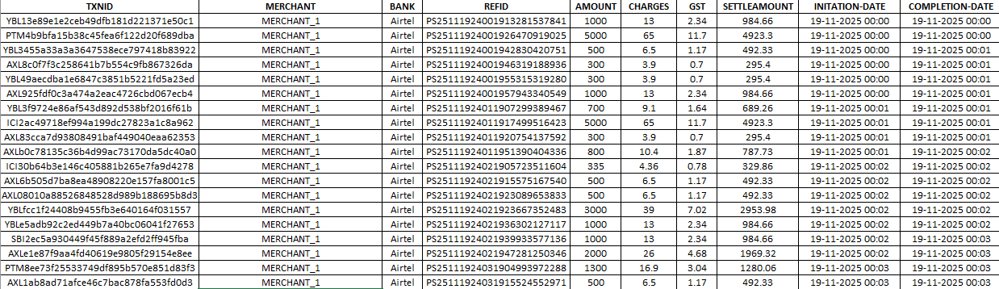
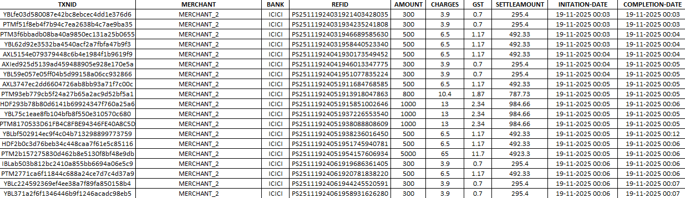

# 📊 Python Automated Transaction Report Generator

## 🧩 Business Problem
Financial transaction systems generate large volumes of raw data that must be analyzed at a merchant level for:<br>
• Risk monitoring<br>
• Fraud detection<br>
• Compliance reporting<br>
• Operational insights

Manually splitting and formatting these reports is: <br>
• ⏱️ Time-consuming<br>
• ❌ Error-prone<br>
• 📉 Not scalable for high-volume datasets<br>

This project automates the entire reporting pipeline.

# 🚀 Solution Overview
This project automates the transformation of raw transaction data into **structured, merchant-wise Excel reports** with professional formatting.

It eliminates manual effort by:<br>
• Splitting data by merchant<br>
• Generating individual Excel reports<br>
• Applying financial-grade formatting<br>
• Producing analysis-ready outputs for stakeholders

# ⚙️ Key Features
• Automatic CSV ingestion using pandas<br>
• Merchant-wise segmentation of transactions<br>
• Individual Excel report generation per merchant<br>
• Professional formatting using openpyxl:<br>
&nbsp;&nbsp;&nbsp;&nbsp;◦ Bold header rows<br>
&nbsp;&nbsp;&nbsp;&nbsp;◦ Center alignment<br>
&nbsp;&nbsp;&nbsp;&nbsp;◦ Cell borders<br>
&nbsp;&nbsp;&nbsp;&nbsp;◦ Date-time formatting<br>
• Auto-adjust column widths for readability<br>
• Scalable structure for large datasets

# 🏗️ System Architecture
The pipeline follows a simple 4-stage process:<br>
**1. Data Ingestion**<br>
Load raw transaction CSV into pandas DataFrame<br>
**2. Data Segmentation**<br>
Split dataset based on unique `MERCHANT` values<br>
**3. Report Generation**<br>
Export each merchant dataset into Excel format<br>
**4. Formatting Layer**<br>
Apply Excel styling using `openpyxl` for readability and presentation

# 📂 Project Structure
```
Python-Automated-Transaction-Report-Generator/
│
├── TRANSACTIONS.csv                 # Input dataset
├── script.py                       # Main automation script
├── destination_folder/             # Generated merchant reports
│   ├── SUSPICIOUS_TRANSACTIONS_REPORT - Merchant_1.xlsx
│   ├── SUSPICIOUS_TRANSACTIONS_REPORT - Merchant_2.xlsx
│   └── ...
└── README.md
```

# 📷 Output Preview
## 📊 Merchant-wise Transaction Report (Full View)

Below are a few sample generated reports:<br>

Merchant_1


Merchant_2


## 🔍 Formatting Detail View

Zoomed-in view showing formatting applied using `openpyxl`:<br>
• Bold headers<br>
• Center alignment<br>
• Borders applied<br>
• Clean financial layout<br>


# 📊 Impact
**Metric**&nbsp;&nbsp;&nbsp;&nbsp;&nbsp;&nbsp;&nbsp;&nbsp;&nbsp;&nbsp;&nbsp;&nbsp;&nbsp;&nbsp;&nbsp; |  **Manual Process**  |  **Automated Process**<br>
Report generation time&nbsp;&nbsp;&nbsp;&nbsp;&nbsp;&nbsp;&nbsp;&nbsp;&nbsp;&nbsp;&nbsp;&nbsp;&nbsp;&nbsp;|      Hours	         |      Seconds
Scalability&nbsp;&nbsp;&nbsp;&nbsp;&nbsp;&nbsp;&nbsp;&nbsp;&nbsp;&nbsp;&nbsp;&nbsp;&nbsp;&nbsp;&nbsp;|	      Low	           |        High
Error rate&nbsp;&nbsp;&nbsp;&nbsp;&nbsp;&nbsp;&nbsp;&nbsp;&nbsp;&nbsp;&nbsp;&nbsp;&nbsp;&nbsp;&nbsp; |	      High	         |      Minimal
Consistency&nbsp;&nbsp;&nbsp;&nbsp;&nbsp;&nbsp;&nbsp;&nbsp;&nbsp;&nbsp;&nbsp;&nbsp;&nbsp;&nbsp;&nbsp;|	   Inconsistent	     |    Standardized

# 🧠 Code Highlights
• **Merchant-wise Splitting Logic**
```
source_dataframe['MERCHANT'].unique()
```

• **Data Filtering**
```
filtered_data = source_dataframe[source_dataframe['MERCHANT'] == merchant_name]
```

• **Excel Export**
```
filtered_data.to_excel(output_file_path, index = False)
```

• **Formatting Layer**
  ◦ Borders applied using `openpyxl.styles.Border`
  ◦ Alignment using `openpyxl.styles.Alignment`
  ◦ Date formatting applied for datetime objects
  ◦ Auto column width optimization for readability

  # 📌 Use Cases
This automation is useful for:
• 🛡️ Fraud & risk monitoring teams
• 💳 Payment transaction analysis
• 📊 Merchant-level reporting systems
• 📑 Compliance & audit workflows
• 📈 Operational analytics dashboards

# 🎯 Key Learnings
• Automating financial reporting workflows using Python
• Working with pandas for data segmentation
• Advanced Excel formatting using openpyxl
• File system automation and dynamic report generation
• Designing scalable data processing pipelines

View my notebook with detailed steps here: 
